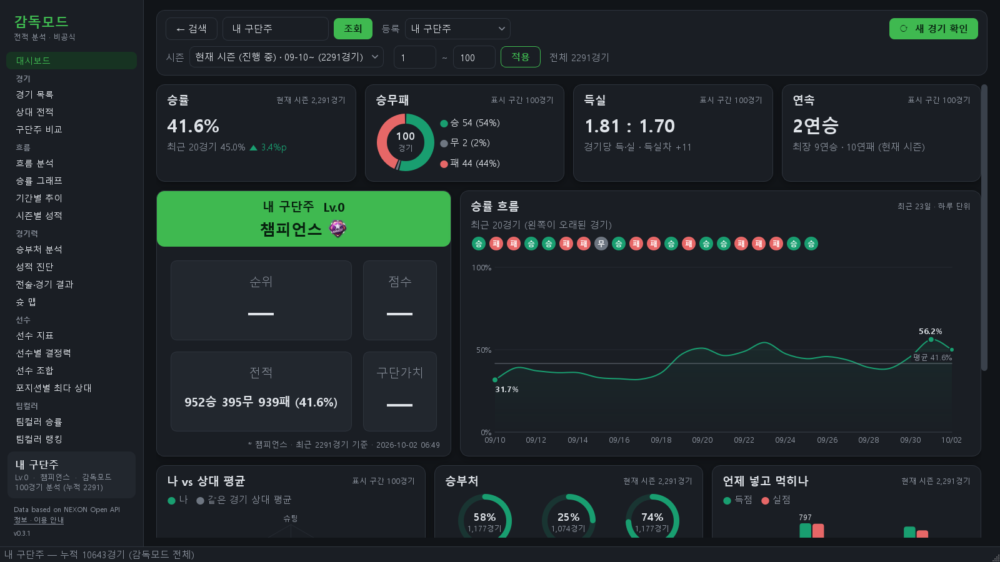
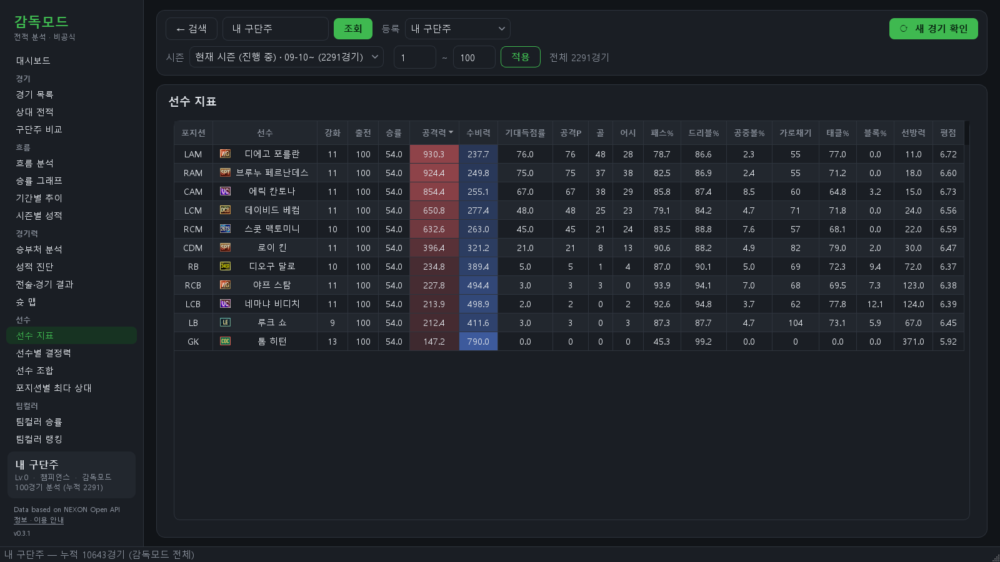
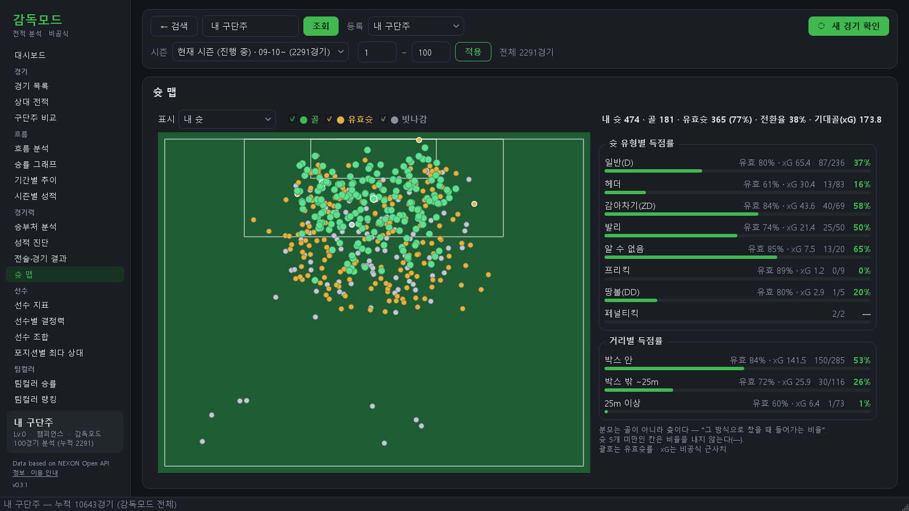
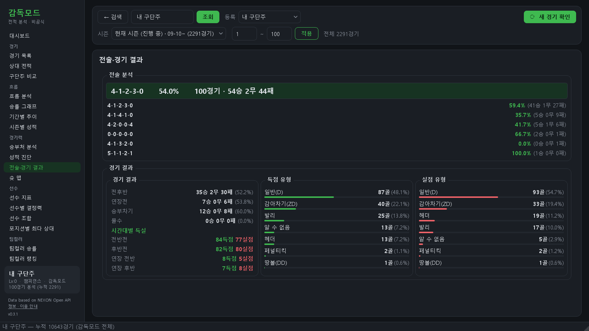
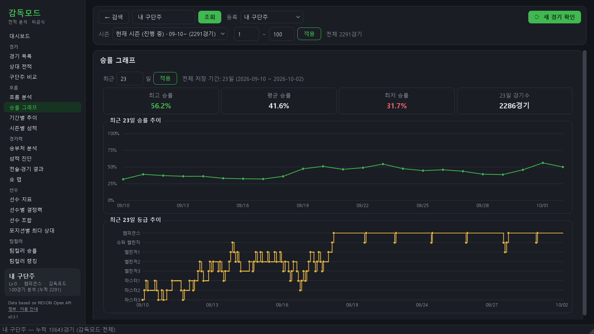
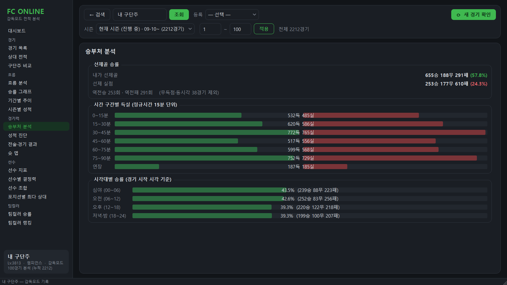
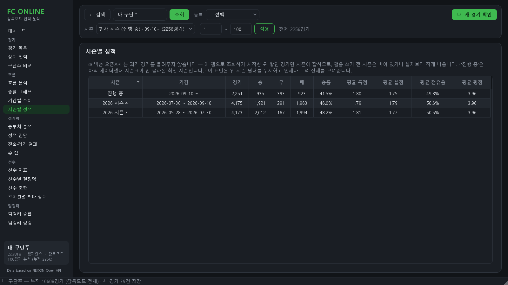
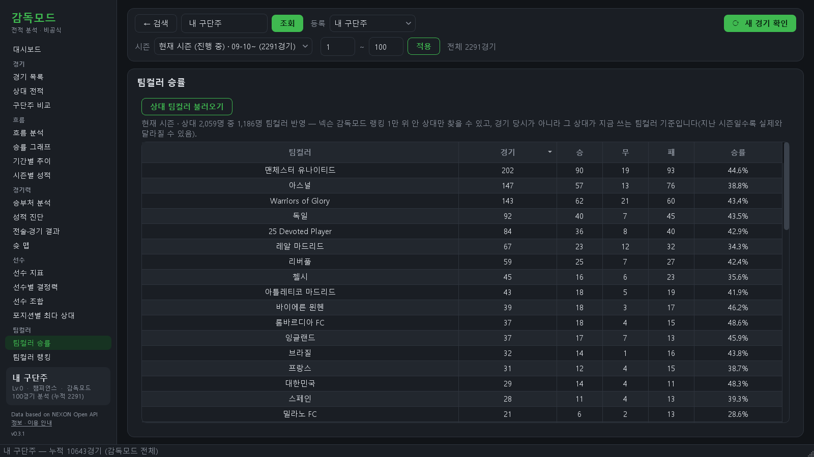

# 감독모드 전적 분석

넥슨 오픈API로 EA SPORTS FC 온라인 전적을 조회·집계하는 **PyQt6 데스크톱 앱**(윈도우).
구단주 닉네임을 검색하면 감독모드 전적을 받아와 승률·선수 지표·전술 상성 등을 화면으로 보여준다.
v0.3.0 까지의 이름은 "피파 전적관리" — 저장소·데이터 폴더·exe 이름은 업데이트가 끊기지 않게 그대로 뒀다.

> **넥슨(NEXON)·EA 와 관련 없는 비공식 프로그램입니다.** FC 온라인·EA SPORTS FC 는 각 사의 상표입니다.
> 무료이며 있는 그대로 제공되고, 쓰다 생긴 손해는 책임지지 않습니다. 자세한 것은 아래 [이용 안내](#이용-안내).

- **형태**: 파이썬 3 + PyQt6 GUI 단일 실행 앱. 서버 없음, 설치 없이 소스로 실행하거나 exe로 빌드
- **데이터**: 넥슨 오픈API(JSON) + 공식 데이터센터 HTML 스크래핑(오픈API에 없는 순위·구단가치·선수 능력치).
  스크래핑은 오픈API 약관 밖이라 **기본 꺼짐** — 첫 실행 안내 창에서 사용자가 켤지 고르고, 나중에 [정보] 에서
  바꾼다(`.env` 의 `FIFA_WEB_DATA=1`). 끄면 랭커 카드·팀컬러·시즌 구분·선수 카드가 빈다.
  요청에는 브라우저인 척하지 않고 앱 이름(`FifaMatchTracker/<버전>`)을 UA 로 밝힌다
- **저장**: 조회할 때마다 로컬 SQLite(`fifa.db`)에 누적 — API가 과거를 무한히 주지는 않기 때문
- **API 키**: 개인 발급 키를 첫 실행 때 앱에서 입력한다(넥슨에 한 번 확인한 뒤 `%LOCALAPPDATA%\피파전적관리\.env` 에 저장, 저장소에 포함되지 않음). 넥슨이 키를 거절하면(만료·폐기) 그 자리에서 다시 묻는다
- **화면**: 창 최소 1280×720(기본 1600×900). 그보다 좁은 화면 반 분할은 지원하지 않는다

## 주요 기능

| 메뉴 / 기능 | 내용 |
|-----------|------|
| 흐름 분석 | 집계를 문장으로 — 최근 흐름과 이기는/지는 방식을 글로 설명 · 연승·연패 직후 다음 경기 승률(전체 대비 ±%p) |
| 전적 | 최근 경기 목록 — 결과·스코어·상대·점유율·슛 등 |
| 선수 지표 | [지표] 선수별 출전·평점·공격력·수비력·기대득점률·선방력(공식 미제공 값 역산) · [랭커 비교] 아래 |
| 전술·경기 결과 | [전술] 상대 전술(포메이션)별 승률 · [경기 결과] 결과·득점·실점 유형 분포 · [패스 스타일] 종류 6가지 비중·성공률, 이긴/진 경기 비교 |
| 상대 전적 | 구단주별 상성 |
| 포지션별 최다 상대 | 자리마다 가장 많이 만난 상대 카드를 축구장에(만난 횟수·비율) · 팀컬러로 거르기(찾기 칸) · 아래 접힌 표 |
| 구단주 비교 | 내 계정과 상대 최근 N경기 — 승률·득실·점유율·평점·경기당 슛·유효슛 비율·패스/태클 성공률 · 키플레이어(골·평점 상위 3) · 양쪽 최근 스쿼드 축구장 |
| 스쿼드 축구장 | 경기 목록 → 상대 스쿼드 · 구단주 비교 — 칩마다 포지션·강화 반영 OVR·강화·시세·이름, 위 띠에 스쿼드 가치·급여 합. 시세·급여·OVR 은 홈페이지에서 하루 최대 60장 자동으로(이용 안내 5 동의 뒤 · 캐시 우선) |
| 승률 그래프 | [승률·등급] 최근 N일 일별 승률(50% 기준선·7일 이동평균·경기 수 띠) · 하루 단위 등급(디비전) 계단 그래프 · 슈퍼 챔피언스 달성 기록(날짜·시각) · [점수·예측] 지금 시즌 ELO 그래프(200·1,000위 컷 · 따라가기) · **시즌 말 순위 예측**(200위·1,000위 안 확률 · 예상 순위 범위 — 랭킹 수집이 켜져 있을 때) |
| 기간별 추이 | 1일/2일/1주/1개월 단위 승률 그래프 + 전적 표(평균 대비 · 최고/최저 기간) + 연승·연패 기록 |
| 시즌별 성적 | 감독모드 랭킹 시즌별 승률 막대 + 전적·승률·지난 시즌 대비·등급 변화·평균 득실 비교 |
| 승부처 분석 | 선제골 승률, 시간대별 득실 분포, 시각대별 승률 |
| 성적 진단 | [상대·점유율] 상대 등급(디비전)별 승률·평균 득실, 점유율 구간별 승률 · [규율·불운] (파울·경고·퇴장·오프사이드·코너킥·골대 나/상대 평균 · 골대·퇴장 경기 승률 · 종료 유형별 경기 수) |
| 선수별 결정력 | 슛·유효슛·골·전환율·xG·어시스트 랭킹 |
| 선수 지표 › 랭커 비교 | 내 카드(가장 많이 세운 자리)의 경기당 슛·유효슛·골·어시·드리블/패스 성공률·태클·블록을 같은 카드·같은 자리 상위 랭커 평균과 "나 / 랭커"로(넥슨 오픈API ranker-stats · 하루 캐시 · 표본 적으면 흐림) |
| 슛 맵 | 슛 좌표를 하프 피치에 시각화(내 슛 / 상대 슛 실점 위치) · [어시스트] 골마다 어시 위치 → 슛 위치 선 |
| 선수 카드 | 능력치·특성·시세·클럽경력 + 강화단계·적응도·팀컬러 시뮬레이터 · [내 기록] 그 카드 슛 맵·주 단위 전환율·주 단위 평균 평점 · [랭커 기록] 그 카드를 쓴 상위 랭커들의 포지션별 경기당 기록(오픈API — 홈페이지 데이터를 꺼도 보인다) |
| 스쿼드·이적 › 가계부 | 넥슨은 **API 키 주인 계정**의 거래만 준다 — 맨 위 "내 계정" 띠(최근 300경기 (카드, 강화) 중 구매 기록에 있는 비율을 참고로) · 넥슨 반영 기준 마지막 거래 날짜. 내 계정이면 지출·수입·순지출 · 실현 손익(같은 카드 선입선출 추정) · 취득가 없음 판매 · 보유 카드 평가 손익(홈페이지 오늘 시세, 하루 캐시) · 최근 구매·안 쓴 카드는 따로 |
| 스쿼드·이적 › 타임라인 | 카드 구매·판매·첫 출전·마지막 출전·강화 변화를 최신순으로 + 사건 앞뒤 20경기 승률·득실(출전은 선발만). 거래는 내 계정에만 |
| 랭커 › 랭킹 추이 | 하루 한 번 모은 랭킹 1만 명(`rank.db` 영구 집계 — 원본 14일과 무관)으로 순위 컷 ELO(1·10·50·100·200위) · 구단가치 평균·중앙값 · 포메이션 비율 · 팀컬러 비율을 스냅숏 날짜별 그래프로. 순위 구간(1~200 · 201~1,000 · 1,001~1만) 선택 · 지금 시즌만 · 이틀치부터. 새 요청 없음 |
| 랭커 › 랭커 픽 | [픽] 랭킹 상위 200명(마지막 랭킹 스냅숏)의 팀컬러·포메이션 비율 · 줄별 많이 쓴 카드(사람 수·강화) · 내 최근 선발에 그 카드의 랭커 픽률. [추천] 내 팀컬러 랭커(① 상위 200 · ② 내 DB 의 상대 중 1만 위 안 — 요청 없음 · ③ 둘이 10명 미만이면 1,000위 안에서 최대 20명 더)가 많이 쓰는데 내 최근 선발에 없는 카드(줄별 · 3명 이상이 쓴 것만) · 내 구단가치·선발 강화 평균·포메이션이 그 후보들 사이 어디쯤인지 · 출처별 인원. 10명 미만이면 추천 안 함. **랭킹 수집이 켜져 있고 이 메뉴를 열어 둔 동안만** 넥슨 오픈API(내 키)로 랭커마다 최근 경기 하나를 받는다 — 하루 최대 300요청, 3일 안에 받은 랭커는 다시 안 묻고, 429 를 두 번 받으면 그날 멈춘다. 받은 경기는 14일 · 수집을 끄면 지운다 |
| 랭커 › 선수로 구단주 찾기 | 카드(이름 2글자부터 · 시즌 · 강화 · 팀컬러)를 최근 30일 선발로 쓴 구단주 — 이 PC 에 저장된 경기(검색한 계정과 그 상대 · 랭커 픽)의 색인에서, 요청 없이. 두 번 누르면 그 구단주 검색 |
| 대시보드 | 지표 4개(시즌 승률 + 최근 20경기와의 차이·승무패 도넛·득실·연속) · 랭커 카드 · 승률 흐름 곡선(평균선·최고/최저) + 최근 20경기 · 나 vs 상대 평균 레이더 · 승부처 게이지 · 15분 득실 막대 · 흐름 분석 3줄 · 시간대 승률 · 자주 만난 상대. 카드마다 상세 메뉴와 같은 범위를 세고(구석에 표기), 누르면 그 메뉴로 간다 |

## 화면

어두운 테마(`theme.MODE` 로 밝은 테마도 고를 수 있다). 닉네임을 검색하면 **왼쪽 메뉴 + 대시보드**로 넘어가고, 메뉴(경기·흐름·경기력·선수·팀컬러·랭커)
에서 상세 화면으로 들어간다. 한 메뉴 안의 구획은 제목 옆 탭으로 나뉜다(위 표의 [ ] — 2.1.1). 메뉴마다 마지막에 본 탭을
기억한다. 시즌·표시 범위·새 경기 확인은 위쪽 바에 고정이라 어느 화면에서든 같다.

> 스크린샷은 실데이터로 찍되 닉네임은 메모리에서만 익명화했다(내 구단주 · 상대1…). 랭커 카드(순위·구단가치)는
> 공개 랭킹에서 계정을 역추적할 수 있어 비웠다. 찍기 전 화면 글자 전부를 실제 닉네임 6,561개와 대조해 0건을 확인했다.

**대시보드** — 지표 4개 · 랭커 카드 · 승률 흐름 · 나 vs 상대 레이더 · 승부처 · 15분 득실 · 흐름 분석 · 시간대 · 자주 만난 상대


| | |
|---|---|
| **선수 지표** — 포지션별 출전·평점·공수 지표(공식 미제공 값 역산)<br> | **슛 맵** — 슛 좌표를 하프 피치에 시각화(골/유효슛/빗나감)<br> |
| **전술·경기 결과** — 상대 포메이션별 승률, 득·실점 유형<br> | **승률 그래프** — 기간별 승률·등급(디비전) 계단 그래프<br> |
| **승부처 분석** — 선제골 승률, 시간 구간별 득실, 시각대별 승률<br> | **시즌별 성적** — 감독모드 랭킹 시즌별 전적·승률·평균 득실(진행 중 시즌 포함)<br> |
| **팀컬러 승률** — 상대 팀컬러별 내 승률(시즌 전체 · 반영된 상대 수 표시)<br> | |

## 받아서 쓰기 (exe)

파이썬 없이 쓰는 방법이다. 바뀐 점은 [CHANGELOG.md](CHANGELOG.md).

1. [릴리스 페이지](https://github.com/yim2412/fifa-match-tracker/releases/latest)에서
   **`FifaMatchTracker-Setup-<버전>.exe`** 를 받아 실행한다. 관리자 권한은 필요 없다(사용자 폴더
   `%LOCALAPPDATA%\Programs\피파전적관리` 에 깔린다). 시작 메뉴에 생기고, 바탕화면 아이콘은
   설치할 때 고른다. 지우는 건 윈도우 "설정 → 앱"에서.
   - 설치 없이 쓰려면 `FifaMatchTracker-<버전>-portable.zip` 을 폴더째 풀고 `피파전적관리.exe` 실행
     (`_internal` 이 옆에 있어야 켜진다).
2. "Windows의 PC 보호" 파란 창이 뜨면 **추가 정보 → 실행**. 서명 인증서가 없는 프로그램이라
   처음 한 번 뜬다(설치 파일도 같다).
3. 처음 켜면 **이용 안내** 창이 뜬다 — 읽고 동의해야 시작된다. 넥슨 홈페이지 데이터(랭킹·구단가치·
   팀컬러·시즌 구분·선수 능력치)를 읽을지도 여기서 고른다(기본 꺼짐, [이용 안내](#이용-안내) 참고).
   이어서 **API 키 입력 창**이 뜬다. [NEXON Open API](https://openapi.nexon.com/) 에 로그인 →
   애플리케이션을 **서비스 단계**로 등록 → 발급된 키를 붙여넣는다(무료).
   개발 단계 키는 [하루 1,000건](https://openapi.nexon.com/ko/support/faq/2354215/)이라, 처음 검색할 때
   받는 약 한 달 치(많으면 3천 경기 넘게)를 끝내지 못한다 — 그러면 앱이 멈추고 키를 바꾸라고 안내한다.
4. 구단주 닉네임을 검색한다.

- 데이터(키·전적 DB·캐시·오류 기록)는 `%LOCALAPPDATA%\피파전적관리\` 에 쌓인다.
  새 버전으로 바꿔도 그대로 남고, 지우려면 이 폴더를 지운다.
- 오류가 나면 `%LOCALAPPDATA%\피파전적관리\logs\crash.log` 를 보내 주면 된다.
- 넥슨 홈페이지 데이터 읽기는 창 아래 **[정보 · 이용 안내]** 에서 켜고 끈다(다음 조회부터 반영).
- **랭킹 수집**(1.1.1, 기본 꺼짐)도 같은 창에서 켠다 — 앱이 켜져 있는 동안 하루 한 번, 정각 뒤 5~50분 사이에
  랭킹 1만 명을 읽어 `rank.db` 에 쌓는다(원본 14일 · 집계는 계속). 홈페이지 데이터를 끄면 같이 꺼지고, 넥슨이
  요청을 계속 막으면 스스로 꺼진다. 하루 안의 기록이 있으면 팀컬러도 거기서 읽어 넥슨 요청이 0이다.
  검색한 구단주의 ELO·순위는 수집과 상관없이 검색할 때마다 기록한다. **[수집 기록 지우기]** 로 둘 다 지운다.
- **트레이 상주**(1.1.1) — 랭킹 수집이 켜져 있거나 자동 실행을 켜 두면 창을 닫아도(X) 작업 표시줄 오른쪽 트레이에
  남는다. 완전히 끄려면 트레이 아이콘 오른쪽 클릭 → **[종료]**. 둘 다 꺼져 있으면 X 가 그대로 끈다.
  숨긴 지 30분이 지나면 경기 기록을 메모리에서 내려놓고, 다시 열 때 저장된 기록을 다시 읽는다. 앱은 한 번만 뜬다 —
  이미 떠 있는데 또 켜면 떠 있던 창이 앞으로 온다.
- **자동 실행**(기본 꺼짐) — [정보] 에서 켜면 윈도우를 켤 때 창 없이 트레이로 시작한다(`--tray`, 시작 프로그램 등록).
  설치판·포터블 exe 에서만 켤 수 있다. ⚠ 1.0.x 로 되돌리기 전에 끄세요 — 옛 버전은 `--tray` 를 몰라 부팅마다 창이 뜬다.
  설치판을 제거하면 등록도 지운다.
- 트레이에 있는 동안 **윈도우 알림은 띄우지 않는다** — 새 버전·수집 상태는 창을 열면 보이고, 숨긴 중 오류는 창을 열 때 안내한다.
- **업데이트**: 켤 때 GitHub 에서 새 버전을 한 번 확인해, 창 오른쪽 아래 카드에 결과를 띄운다 — 새 버전이면 [업데이트], 최신이면 "최신 버전입니다"(첫 검색 화면에서만 — 메인 화면은 가리지 않는다. 둘 다 닫을 때까지 남고, 확인을 못 했으면 안 뜬다). 창 왼쪽 아래(메인 화면은 사이드바 맨 아래)에는 버전과 상태가 늘 보인다 — "v1.0.2 · 최신 버전입니다" · "새 버전 vX [업데이트]" · 확인을 못 했으면 "업데이트 확인 못 함"(최신이라고 하지 않는다).
  설치 파일로 깐 경우 **[업데이트]** 를 누르면 내려받아 체크섬을 확인하고, 앱이 닫혔다가 새 버전으로
  다시 켜진다(전적 기록은 그대로). 포터블(zip)은 받기 페이지가 열린다. 확인을 끄려면 `.env` 에
  `FIFA_UPDATE_CHECK=0`.

## 빌드·배포

```powershell
python tools/release.py     # 빌드 → zip · 설치 파일 → 개인정보 검사 → 공개 명령 출력
```

1. `config.APP_VERSION` 을 올리고 `CHANGELOG.md` 에 그 버전 절을 쓴 뒤 **커밋한다**(안 하면 멈춘다).
2. `tools/release.py` 가 `dist\` 에 `FifaMatchTracker-Setup-vX.Y.Z.exe` · `FifaMatchTracker-vX.Y.Z-portable.zip` · `SHA256SUMS.txt` 를 만들고,
   배포물 안(exe 안의 압축된 코드까지)에서 **이 PC 의 홈 폴더 경로 · 프로젝트 경로 · API 키 · git 이메일**을
   찾는다. 반드시 있어야 할 대조 문자열이 안 잡히면 "0건"을 믿지 않고 멈춘다.
   더 찾을 말은 `RELEASE_SCAN_EXTRA="a,b"`.
3. 마지막에 출력되는 `gh release create …` 를 확인하고 직접 친다 — 공개는 스크립트가 하지 않는다.

설치 파일은 [Inno Setup 6](https://jrsoftware.org/isdl.php)(무료)이 필요하다 — 스크립트는 `installer/피파전적관리.iss`.
앱의 새 버전 알림은 릴리스 태그(`vX.Y.Z`)를 읽는다.

## 시작하기 (소스)

```powershell
git clone https://github.com/yim2412/fifa-match-tracker.git
cd fifa-match-tracker

# 1) 패키지 설치
pip install -r requirements.txt

# 2) API 키 — 앱을 처음 켜면 입력 창이 뜬다(아래 4번). 터미널 점검(3번)을 먼저
#    하려면 .env.example 을 복사해 .env 로 만들고 키를 넣는다
copy .env.example .env
notepad .env

# 3) API 연결 점검 (GUI 전에 먼저, 선택)
python check_api.py 내닉네임

# 4) 앱 실행
python app_main.py

# 5) 파싱·집계 회귀 테스트 (네트워크 없이, 실제 응답 픽스처로)
python tests/test_parsing.py
python tests/test_ui_smoke.py   # 화면 배선(offscreen)
python tests/test_rankcollect.py   # 랭킹 수집기
python tests/test_tray.py   # 트레이 상주·자동 실행·한 번만 실행
python tests/test_release.py   # 배포 검사 로직
python tests/test_rules.py   # 규칙 검사(인코딩·색·콤보박스·대화상자 크기·모달·신호·SQL 실행 계획)
python tests/test_review_kit.py   # 계획 검토 준비 도구
```

## 파일 구조

| 파일 | 역할 |
|------|------|
| `app_main.py` | PyQt6 UI — 검색 화면, 왼쪽 메뉴(`NAV` 표) + 위쪽 바 + 메뉴별 페이지(대시보드·흐름 분석·선수 지표·전술·승부처 분석·성적 진단·슛 맵·결정력·팀컬러·스쿼드·이적 등 18개 — 메뉴 안 구획은 페이지 안 탭 `Tabs`), 조회 워커 스레드 · 거래 받기(`TradeLoader`) |
| `dashboard.py` | 대시보드 페이지 — 카드 배치·채우기(`DashboardPage.render`), 카드별 범위 규칙 |
| `charts.py` | 대시보드 그래프(QPainter) — 영역 곡선·도넛·링 게이지·묶음 막대·레이더·결과 점·가로 막대 |
| `widgets.py` | 화면 부품(위젯) — 카드(`Card`·`add_shadow`)·랭커 카드·표(`FitTableWidget` — 모든 표)·좁으면 두 줄로 접히는 위쪽 바(`WrapBar`)·세로 스크롤 틀(`VScrollArea`)·글꼴이 줄어드는 라벨(`FitLabel`)·승률/등급 그래프·축구장 v2(`PitchWidget` — 줄마다 폭을 나눠 칩이 안 겹친다 · 접는 구획 `Collapsible`)·슛 맵·`NoScrollComboBox` 등 |
| `theme.py` | 테마 — 어두운·밝은 팔레트(`MODE` 로 선택)·전역 스타일시트(QSS)·`apply()`(Fusion + 팔레트 + 기본 글꼴). **QSS 에 font-size 를 넣지 않는다**(setFont 를 이긴다) |
| `nexon_api.py` | 넥슨 오픈API 클라이언트. **엔드포인트 경로·에러코드가 전부 여기 상수에 모여 있다** |
| `models.py` | 매치 상세 JSON → `MatchSummary` 파싱, `Stats`·상대 전적·승률 추이 집계 |
| `stats.py` | 여러 경기 집계 — 선수 지표·전술·경기 결과. **역산해서 알아낸 상수가 여기 모여 있다** |
| `analysis.py` | 집계 → 문장. 최근 흐름(최근 20경기)과 이기는/지는 패턴(누적 전체)을 규칙 기반으로 서술 |
| `predict.py` | 시즌 말 순위 예측(1.3.1) — 같은 점수대 구단주들의 실제 하루 ELO 변화(랭킹 수집 원본)를 이어 붙여 2,000번 굴린다. 아래 "시즌 말 순위 예측" |
| `core_api.py` | 화면과 분석 사이의 경계 — 화면 쪽 파일은 분석 함수를 여기서만 가져온다 |
| `store.py` | 조회한 경기를 SQLite(`fifa.db`)에 누적 — API가 오래된 경기를 버리는 것을 넘기 위해 |
| `ranker.py` | 넥슨 데이터센터에서 감독모드 순위·구단가치·ELO 를 긁어온다(오픈API 엔 없음) |
| `rankerstats.py` | 랭커 기록 받기(1.4.1) — 하루 캐시(`fifa.db ranker_stats`)에 없는 (카드, 자리)만 넥슨에 50쌍씩(한 요청 상한은 URL 길이) · 데이터 없는 쌍도 그날 기억 |
| `tradecollect.py` | 거래 기록 받기(1.4.1) — 키 주인 계정의 구매·판매를 `fifa.db trades` 에. 키가 바뀌면 옛 주인 거래는 따로 옮겨 두고(지우지 않는다) 새 주인 것을 다시 · 새 거래는 하루 한 번(7일 겹쳐서) · 첫 수집이 끊겨도 옛 거래를 이어 받는다 |
| `squad_timeline.py` · `trade_book.py` | 스쿼드 타임라인(경기 + 거래 → 사건 · 구매↔판매 선입선출 짝 · 판 기록 없는 구매의 보유 상태) · 가계부(지출·수입·손익) — 화면 없이 계산만 |
| `rankerpick.py` | 랭커 픽(2.1.1) — 스냅숏 상위 200명의 최근 경기를 오픈API 로 받는 규칙(하루 계수 · 재시도 끔 · 요청 간격 · 429 · 3일)과 화면 집계 · 추천(내 팀컬러 후보 ①②③ → 줄별 대체 카드 · 내 스쿼드 위치). 화면 없이 `tests/test_rankerpick.py` 가 잰다 |
| `rankcollect.py` | 랭킹 1만 명을 하루 한 번 모아 `rank.db` 에 쌓는 수집기(1.1.1 — 기본 꺼짐, [정보] 에서 켠다). 팀컬러 목록과 같은 읽기를 나눠 쓴다. 터미널 확인: `python rankcollect.py --pages 3` |
| `tray.py` | 트레이 상주(1.1.1) — 트레이 아이콘, 모든 종료가 거치는 `quit_app`, 한 번만 실행, 숨긴 창 기록 내려놓기, 상주 중 6시간마다 업데이트 확인 |
| `autostart.py` | 자동 실행 — 윈도우 시작 프로그램(HKCU Run)에 `"<exe>" --tray` 등록(exe 에서만, 설치판·포터블 이름을 나눔) |
| `seasons.py` | 감독모드 랭킹 시즌표(번호·이름·기간)를 데이터센터에서 긁어와 경기를 시즌에 나눠 담는다 |
| `images.py` | 넥슨 CDN에서 선수 얼굴 이미지를 받아 디스크에 캐시(오픈API 아닌 정적 CDN, 비공식) |
| `playerinfo.py` | 선수 카드 상세(능력치·특성·시세·클럽경력) — 넥슨 모바일 데이터센터 HTML 스크래핑 |
| `config.py` | API 키 로드·저장(.env), DB 경로, 웹 데이터 스위치, 매치 종류·조회 개수 기본값 |
| `crashlog.py` | 처리 안 된 예외를 `%LOCALAPPDATA%\피파전적관리\logs\crash.log` 에 남기고 첫 오류 때 위치를 알려 준다 |
| `check_api.py` | 터미널에서 키·엔드포인트·집계·DB 동작 확인용 |
| `tests/test_parsing.py` | 파싱·집계 회귀 테스트 — 실제 응답 픽스처로 골든값 고정(네트워크 없음) |
| `tests/test_rankcollect.py` | 랭킹 수집기 테스트 — 가짜 랭킹 목록으로 쪽 판정·실패 대기·차단 시 끄기·잠금·집계·랭킹 추이(지금 시즌 · 하루 마지막)(네트워크 없음) |
| `tests/test_trades.py` | 거래 받기·시세 캐시 테스트 — 가짜 거래 목록으로 끊김·겹침·429·키 바뀜·하루 상한(네트워크 없음) |
| `tests/test_timeline.py` | 타임라인·가계부 테스트 — 지어낸 경기·거래로 짝·보유 상태·앞뒤 창·범위 · 1만 경기 예산(300ms) |
| `tests/test_rankerpick.py` | 선수 색인·랭커 픽 테스트 — 지어낸 경기·가짜 API 로 색인(몰수·깨진 경기)·백필 이어 하기·하루 상한·429·닉네임 바뀜·지우기(지운 닉네임이 파일 바이트에 없는지까지) · 추천 후보 출처·문턱 경계 · 2만 경기 백필 · 추천 200명 예산 |
| `tests/test_tray.py` | 트레이 상주 테스트 — 종료 진입점·X 숨김 규칙·한 번만 실행 판정·자동 실행(가짜 레지스트리)·내려놓기 미룸 |
| `tests/test_analysis.py` | 흐름 분석 회귀 테스트 — 임계값 경계·가중치 정규화(네트워크 없음) |
| `tests/test_rules.py` | 규칙 검사 — 프로젝트 규칙(인코딩 명시·색은 theme.py 에서만 등)을 코드 전체에 기계로 대조하고, 모든 SQL 의 실행 계획에 큰 표 통째 정렬이 없는지 본다 |
| `tests/test_predict.py` | 예측 테스트 — 가짜 스냅숏으로 하루 걸음 표본·되돌림 상식·흐름 쏠림·골든·원인별 문구(네트워크 없음) |
| `tools/season_notice.py` | 시즌 종료일 공지 — 최신 릴리스 본문의 안 보이는 한 줄만 바꾼 파일과 `gh release edit` 명령을 출력(공개는 사람이) |
| `tools/check_predictions.py` | 시즌이 끝난 뒤 남겨 둔 예측을 실제 최종 순위와 대조(수동) |
| `tools/review_kit.py` | 계획 검토 준비 — 계획 절이 짚은 코드 조각 묶음(`bundle`) · 회차 사이 바뀐 계획 줄(`diff`) · 주장 장부 빈 표(`ledger`). 쓰는 법은 `docs/ROADMAP.md` "검토 방법" |

기본 매치 종류는 **감독모드(52)** 다 — 이 앱은 감독모드 전적을 본다.

## 누적 저장 (`fifa.db`)

**API는 과거를 무한히 주지 않는다.** 한 번에 받는 개수 상한이 100이고, `offset`으로
그보다 과거까지 받을 수 있지만 **끝이 있다.**

```
2026-09-05 실측 (GB쭈우 · 감독모드 · get_match_ids)
  offset=0     100개       offset=500   100개
  offset=100   100개       offset=3000   24개   ← 여기서 끝. 총 3,024경기
```

같은 시점 `fifa.db`에는 **7,859경기**가 있다(2026-06-17~). API가 닿는 가장 오래된
경기는 대략 **2026-08-04**(DB 기준 최신에서 3,024번째)이라, **한 달 남짓 지난 경기는
API에서 사라진다.**

> ⚠️ **여기 오래 틀린 값이 적혀 있었다.** *"API는 최근 100경기까지만 준다 · 하루만
> 걸러도 영영 못 가져온다"* — 100은 **한 번에 받는 개수 상한**이지 전체 상한이 아니다.
> 이 판단은 2026-07-18(`d872ef5`)에 이미 정정됐는데 문서에는 반영되지 않았고,
> 오히려 07-24 README 정비 때 다시 적혔다. 2026-09-05에 실측으로 고쳤다.
> **누적 저장이 필요하다는 결론 자체는 그대로다 — 이유의 규모가 틀렸을 뿐이다.**

그래서 조회할 때마다 `fifa.db`에 쌓고, 화면은 API가 아니라 DB를 그린다.
검색하는 순간이 곧 수집이라, 자주 보는 계정일수록 데이터가 길어진다.

- **저장 기준은 `ouid`** — 구단주명은 바뀌어도 ouid는 안 바뀐다
- **경기 원본은 한 번만** — 한 경기에 두 명이 나오므로 `matches` / `match_players`로 분리.
  상대를 검색하면 이미 받아 둔 경기가 재활용된다
- **이미 있는 경기는 API를 다시 부르지 않는다** (`store.existing_ids`)
- **등록 계정** — 조회하면 자동 등록. 목록에서 고르면 바로 조회. 등록 해제해도 경기 기록은 남는다
- **검색 속도** — 저장된 기록 읽기(1만 경기 약 2초, 대부분 JSON 해석)는 넥슨 조회와 동시에 한다.
  켤 때 마지막으로 검색한 계정의 기록을 뒤에서 미리 읽어 두므로 그 계정은 더 빠르다(화면은 검색창 그대로).
  2026-10-04 실측(1만 832경기): 검색 → 첫 화면 5.3초 → 마지막 계정 약 1.3초 · 다른 계정 약 3초.
  처음 보는 계정은 경기 상세를 동시 24개로 받는다(3,130경기 119초 → 38초, 서비스 키). 429 를 받으면
  그 검색은 2개로 내린다(`app_main.DETAIL_WORKERS` · `DETAIL_WORKERS_THROTTLED`)
  ⚠️ DB 를 열 때 통계를 갱신한다(`PRAGMA optimize`) — 통계가 생기면 SQLite 가 계획을 바꾸므로,
  경기 기록 본문을 읽는 쿼리는 `(종류, 날짜)` 인덱스를 직접 지정한다(안 그러면 본문을 통째로 정렬했다)

- **거래 기록(1.4.1)** — `trades`(구매·판매 한 줄씩, ouid 열 없음 — **API 키 주인**의 거래라서) · `trade_state`(키 지문 ·
  받기 진행 · 내 계정) · `card_prices`(카드 강화 단계별 시세, 하루 캐시). 2026-10-06 실측: 첫 수집 163요청 · 19초 ·
  구매 4,430 + 판매 11,473건 · DB +3.8MB. 거래 API 는 2022-01-27 부터 주고, 반영은 며칠 늦을 수 있다(그날 마지막 거래 09-30)
- **카드 정보(2.1.1)** — `card_info`(카드 하나에 급여·1강 OVR · 30일) · `api_budget`(그날 쓰임별 홈페이지 요청 수 — 축구장 칩 60 ·
  가계부 시세 80. 재시작해도 남는다). 강화별 OVR 은 1강 값 + `config.GRADE_OVR_BONUS`(시뮬레이터 실측 — `check_api` 가 다시 대조)
- **선수 색인(2.1.1)** — `match_squads`(카드 · 날짜 · 경기 · 구단주 · 자리 · 강화 — 선발만, 정수 키 `WITHOUT ROWID`) + 번호 표
  `squad_owner`·`squad_match`. 새 경기는 저장과 같은 커밋에서, 옛 경기는 켠 뒤 30초(트레이 시작이면 2분)부터 낮은 우선순위로
  1,000경기씩 채운다(검색이 돌면 양보). 2026-10-06 실DB 사본(2.1만 경기): **14.7MB · CPU 4.5초** · 가장 많이 쓰인 카드 조회 4.4ms
- **랭커 픽(2.1.1)** — `ranker_squads`(랭커마다 ouid·최근 경기·받은 시각·실패) · `ranker_matches`(랭커 픽으로 들어온 경기 표시 —
  14일 정리·지우기의 범위. 검색한 계정이 나온 경기는 지우지 않는다). 모든 연결이 `secure_delete` — 지운 다른 구단주 닉네임이
  파일 빈칸에 남지 않게(VACUUM 은 안 한다)

> 한계: **API가 이미 버린 과거는 못 되살린다.** 처음 조회 시점에 API가 주는 만큼
> (실측 3,024경기 · 약 한 달)이 시작점이고, 그보다 이전은 없다. 조회 간격이 그보다
> 길어지면 그 사이가 뚫린다.

## 감독모드 랭킹 (`ranker.py`)

순위·구단가치·랭킹점수(ELO)는 **오픈API(JSON)에 없다.** 넥슨 공식 데이터센터
웹페이지에는 있어서 거기서 긁어온다.

```
https://fconline.nexon.com/datacenter/rank_inner?rt=manager&strCharacterName=<닉네임>
```

- JSON API 가 아니라 **HTML 스크래핑**이다. 넥슨이 페이지 구조(class 이름)를 바꾸면
  깨진다. 그래서 URL·class·정규식을 전부 `ranker.py` 한 곳에만 둔다 — 깨지면
  실제 응답과 대조해 거기만 고친다.
- 여기 전적은 **감독모드 통산**(오픈API 의 최근 3천 경기보다 많다)이라 랭커 카드는
  이 값을 우선 쓴다. 단 요약 숫자일 뿐 경기별 상세는 아니다.
- 랭킹은 상위 1만 위까지만. 밖이면 순위·구단가치·점수를 "랭킹 밖"으로 두고
  전적은 앱이 받은 경기로 집계한다.
- **상대 팀컬러** — 팀컬러 메뉴·포지션별 최다 상대는 위쪽 **시즌 콤보 범위**로 센다(표시 구간 100경기면
  팀컬러마다 1~2경기라 승률이 안 된다). 새로 찾을 상대가 500명보다 많으면 상대마다 검색하는 대신
  **랭킹 목록 1만 위(20명 × 500쪽)를 통째로 읽는다**(`ranker.fetch_rank_page` · `RankListLoader`).
  찾을 수 있는 범위(1만 위 안)는 같고 요청은 500번으로 고정이다. 적으면 그 상대만 검색한다.
  - 2026-10-02 실측(동시 8): 목록 500쪽 **48.8초**로 누적 상대 6,375명이 한 번에 정리됐다(찾음 3,504 ·
    1만 위 밖 2,871). 같은 수를 상대마다 검색하면 1건 0.106초라 약 11분.
  - 결과는 DB 에 7일 캐시(`store.TEAM_COLOR_TTL_DAYS`) — 그 사이엔 그날 새로 만난 상대만 검색하고, 만료되면 다시 목록을 읽는다(약 50초).
  - 한 쪽이라도 못 읽으면 못 찾은 상대를 '랭킹 밖'으로 저장하지 않는다(다음 조회 때 다시).
  - 팀컬러는 경기 당시가 아니라 상대가 **지금** 쓰는 것이다 — 지난 시즌일수록 실제와 다를 수 있다.

## 시즌 말 순위 예측 (`predict.py`)

"지금 흐름이 이어지면 시즌이 끝날 때 몇 위쯤일까"를 확률로 낸다. **랭킹 수집이 켜져 있어야** 한다.

- 재료: 수집 원본(14일)에서 하루 간격(20~28시간)·같은 시즌인 이웃 스냅숏 쌍마다 구단주별 (시작 ELO, 하루 변화, 그날 경기 수).
  승·무·패가 시즌 누적이라 이웃 차가 그 사이 경기 수다(2026-10-05 실측: 스냅숏 2,601 vs 저장 경기 2,602).
- 경로마다 날마다 내 최근 14일 하루 경기 수 하나를 뽑고, 지금 ELO ±50 · 같은 경기 수 칸(4분위) · 같은 "직전 사흘 변화"
  3분위의 실제 하루 변화를 하나 더한다. 같은 구단주의 이어진 사흘이 충분하면 사흘째 붙인다(연승·연패 연속성).
  점수가 높을수록 하루 변화가 작아지는 **되돌림이 표본에 그대로 들어 있어** 한 방향으로 폭주하지 않는다.
- 끝 ELO 를 지난 시즌 최종 컷(시즌 길이가 비슷할수록 크게 뽑음 · 순위마다 지금 컷보다 낮지 않게)에 대어 순위를 낸다.
- 시즌 종료일은 넥슨이 미리 안 알려 줘서 최근 12시즌 길이로 추정한다. 개발자가 알게 되면 `tools/season_notice.py` 로
  릴리스 본문에 `<!-- season-end: … start: … -->` 한 줄을 넣는다 — 앱은 업데이트 확인 응답에서 읽는다(새 버전 불필요).
- 조건이 안 맞으면 숫자 대신 이유(수집 꺼짐 · 모으는 중 N일 · 1만 위 밖 · 점수대 기록 적음 · 경기 적음 · 지난 시즌 컷 없음 ·
  마감 처리 중). 아직 실제와 맞춰 본 적이 없어 늘 "검증 전"을 붙인다 — 시즌이 끝나면 `tools/check_predictions.py`.
- 계산 시간(1만 명 × 14 스냅숏 가짜 표본): 걸음 표본 0.4~0.6초(원본이 같으면 캐시) · 2,000경로 × 20~60일 224~284ms. 작업 스레드.

## 시즌별 보기 (`seasons.py`)

오픈API 는 경기에 시즌을 달아주지 않는다(`matchDate` 만 준다). 대신 데이터센터
랭킹 페이지가 **시즌 목록을 기간과 함께** 갖고 있어서, 그 기간표로 경기를 나눈다.

```
https://fconline.nexon.com/datacenter/rank?rt=manager
→ ChangeSeason(89) "시즌 3 (2026-05-28~2026-07-30)"
```

- `rt` 에 따라 시즌 **번호가 다르다**(공식경기 91 = 감독모드 89, 기간은 같다).
  이 앱은 감독모드만 다루므로 항상 `rt=manager` 로 받는다.
- 앞 시즌 종료일 == 다음 시즌 시작일이라, 종료일은 포함하지 않는 경계로 보고
  **[시작, 종료)** 로 자른다. 안 그러면 경계일 경기가 두 시즌에 겹친다.
- **진행 중인 시즌은 목록에 안 올라온다.** 마지막 종료일 이후 경기는 "진행 중"으로
  따로 묶어 보여준다.
- 시즌표는 DB(`seasons` 테이블)에 캐시하고 하루에 한 번만 다시 긁는다. 조회에
  실패해도 지난 캐시를 그대로 쓰고, 캐시조차 없으면 시즌 기능만 빠진 채 판수
  기준 화면은 평소대로 돈다.
- 한계: API 가 과거 경기를 안 주므로 **앱을 쓰기 시작한 뒤 쌓인 경기만** 시즌에
  잡힌다. 지난 시즌은 비어 있거나 실제보다 적게 나온다.

## API 메모

- 호스트: `https://open.api.nexon.com`
- 인증: 요청 헤더 `x-nxopen-api-key`
- 키 발급: [NEXON Open API](https://openapi.nexon.com/) 로그인 → 마이페이지

사용 중인 엔드포인트 (`nexon_api.py` 상단 상수):

| 상수 | 경로 | 용도 |
|------|------|------|
| `EP_ID` | `/fconline/v1/id` | 닉네임 → ouid |
| `EP_USER_BASIC` | `/fconline/v1/user/basic` | 계정 기본 정보 |
| `EP_MAX_DIVISION` | `/fconline/v1/user/maxdivision` | 최고 티어 · 그 티어 최근 달성일(시즌 무관) |
| `EP_USER_MATCH` | `/fconline/v1/user/match` | 매치 id 목록 |
| `EP_MATCH_DETAIL` | `/fconline/v1/match-detail` | 매치 상세 |

메타데이터(매치 종류·선수·시즌·등급)는 인증 없이 `https://open.api.nexon.com/static/fconline/meta/{name}.json`.

> 공식 문서가 자바스크립트로 렌더링돼 경로를 자동 대조하지 못했다.
> `check_api.py`가 FAIL이면 [공식 문서](https://openapi.nexon.com/ko/game/fconline/)와 대조해
> `nexon_api.py` 상단 상수만 고치면 된다.

### 응답에서 역산해 알아낸 것 (공식 문서에 없음)

실제 응답 100경기로 확인한 내용. 상수는 `stats.py` 상단에 있다.

| 항목 | 내용 | 어떻게 확인했나 |
|------|------|-----------------|
| `shoot.goalTotal` 등이 **null** | 상대 탈주 등 기록 없는 경기는 키를 빼지 않고 `null`로 준다. `.get(k, 0)`은 기본값이 안 먹으니 타입까지 확인해야 한다(`models._i`) | 30경기 조회 시 `TypeError`로 재현 |
| `shootDetail[].result` | `3` = 골 | `result==3` 개수가 `goalTotal` 합계와 정확히 일치(126/126) |
| `shootDetail[].goalTime` | 비트 패킹. `>>24` = 구간(0 전반/1 후반/2 연장전반/3 연장후반), `& 0xFFFFFF` = 경과 초 | 구간 0·1은 최대 49.8분(45+추가), 2·3은 19.1분(15+추가)으로 딱 맞음 |
| `shootDetail[].type` | 슛 유형. 1 일반(D) · 2 감아차기(ZD) · 3 헤더 · 6 땅볼(DD) · 7 발리 · 8 프리킥 · 9 페널티킥 | 8·9는 `goalFreekick`/`goalPenaltyKick` 집계와 200개 선수-경기 행에서 경기별 정확히 일치. 나머지는 외부 전적 사이트의 유형별 골 수와 합계 일치 |
| `shootDetail[].result` 1 · 2 | **1 = 유효슛(막힘) · 2 = 빗나감**(3은 골) | `effectiveShootTotal == 골+result1`이 1189/1190, `shootTotal == shootDetail 총개수`가 1190/1190 |
| `shootDetail[].x` · `.y` | 슛 좌표(0~1 정규화). **x=1.0이 상대 골문 쪽**(슛이 x>0.48에 몰림), **y=0.5가 폭 중앙**. `assistX/Y`·`hitPost`·`inPenalty`도 있음 | 실제 캐시 1,190 선수-경기로 범위·방향 확인 |
| `type` 4 · 10 · 13 · 14 | **미상.** "알 수 없음"으로 표시 | 근거 없음. 참고한 사이트도 못 읽는다 |
| `shoot.shootOutScore` | 승부차기 점수. 승부차기가 없었으면 양쪽 0 | 2:2 무승부인데 승/패가 갈린 경기에서만 0이 아님 |
| `spPosition` | `28` = SUB(교체 명단). 전술은 GK·SUB 제외하고 수비(1-8)-수미(9-11)-미드(12-16)-공미(17-19)-공격(20-27) 인원 | 상대 전술별 승률이 외부 사이트와 일치(4-1-2-3-0 → 51.7%, 31승3무26패) |

> 매치 상세는 **경기별 실제 스쿼드**를 준다(현재 스쿼드를 돌려주는 게 아니다).
> 볼타 66경기에서 서로 다른 스쿼드 조합 10개가 나오는 것으로 확인.

## 앞으로

> 앞으로 할 일(버전별 상세 계획)은 [`docs/ROADMAP.md`](docs/ROADMAP.md) 한 곳에 있다. 아래는 이미 끝난 것들이다.

- [x] 선수별 통계 — `stats.aggregate_players`
- [x] 상대 전술별 승률 — `stats.formation_stats`
- [x] 공격력·수비력·기대득점률·선방력 — API 미제공이라 fc-info.com 프론트엔드 JS 번들
      (`pages/analysis/coach/[id]-*.js`)에서 계산식을 그대로 역산해 옮겼다(`PlayerStat`).
      실제 100경기로 재현해 값이 거의 일치함을 확인(GK 선방력 151.5 vs 참고 151.6 등).
      선방력은 defending **합계가 아니라 경기당 평균×100**이다 — 100경기 표본에서
      우연히 합계처럼 보였을 뿐, 경기 수가 다르면 값이 완전히 달라진다
- [x] 상대 구단주별 상성 분석 — `models.opponent_stats`, "상대 전적" 탭
- [x] 기간별 승률 추이 차트 — `models.win_rate_trend`(월별), "승률 추이" 탭
- [x] 조회 결과 로컬 DB(SQLite) 누적 — `store.py`
- [x] 선수 이미지 (넥슨 CDN) — `images.py`. 오픈API가 아니라 비공식 CDN 직링크
      (`fco.dn.nexoncdn.co.kr`)라 넥슨이 바꾸면 깨질 수 있다
- [x] exe 빌드 (PyInstaller)
- [x] 선수 카드 상세(능력치·특성·시세·클럽경력) — `playerinfo.py`, 상대 스쿼드·선수 지표
      표·포지션별 최다 상대 표에서 선수 클릭(더블클릭)
- [x] 선수 카드 능력치 시뮬레이터 — 강화단계(1~13강, 기본 1강)·적응도(+1/+5, 기본
      +1 — 홈페이지 첫 화면과 동일 기준)·팀컬러(소속/강화/관계 3종)를
      바꿔가며 실제 능력치 확인. 로컬 근사
      계산이 아니라 **PC 데이터센터(`fconline.nexon.com`)가 실제로 쓰는
      `/datacenter/PlayerAbility` 엔드포인트를 그대로 호출**해서 넥슨 서버가
      계산한 값을 받는다(`playerinfo.fetch_player_ability`) — 팀컬러 종류(600여개)별
      보너스 조합표를 넥슨이 공개하지 않아 근사가 불가능하므로, 정확성을 위해
      매 조작마다 재조회하는 방식을 택함. 팀컬러 드롭다운은 응답 HTML에 같이 오는
      **그 선수 전용 선택지**로 채운다(전체 목록 페이지 불필요). 레벨 UI는 없음 —
      소속 팀컬러는 항상 그 팀컬러의 최대 레벨(대부분 4)로 자동 조회하고, 강화
      팀컬러는 항목 자체에 레벨이 있으며("Lv.2 금빛 물결"), 관계 팀컬러는 레벨이 없다.
      능력치 값 색상도 데이터센터와 같은 10점 구간 기준(`playerinfo.stat_color`).
      "포지션별 오버롤" 탭 — 데이터센터 축구장 그림의 16개 포지션 값(1강·적응도 +1 기준)
- [x] 구단주 비교 탭에 각 계정의 최근 경기 스쿼드 표시 — `stats.own_squad`
- [x] 등급(디비전) 추이 그래프 — 승률 그래프 탭 아래, 매 경기 당시 division을
      계단 그래프로(저장된 데이터만 사용, 추가 조회 없음)
- [x] 기간별 추이 탭 — 누적 전체를 1일/2일/1주/1개월 단위로 묶은 전적 표
      (`models.period_stats`) + 현재/최장 연승·연패(`models.longest_streaks`)
- [x] 팀컬러 랭킹 표에 팀컬러별 평균/최저/최고 팀가치 — 팀컬러를 긁을 때 같은
      페이지에 있는 구단가치를 같이 저장(추가 요청 없음). 캐시 TTL은 팀컬러·팀가치
      모두 7일. 넥슨 웹 점검 중 응답은 "랭킹 밖"으로 오인해 캐시하지 않도록 감지
- [x] 승부처 분석 탭 — 이미 저장된 `shootDetail`만으로 계산(추가 조회 없음).
      선제골 승률(`stats.clutch_summary`: 내가 선제골/선제 실점 시 승률, 역전승·역전패),
      정규시간 15분 6구간+연장의 득실 분포(`stats.goal_minute_buckets`),
      시각대별 승률(`stats.time_of_day_rates`: 심야/오전/오후/저녁밤 4구간)
- [x] 선수별 결정력 랭킹 — `shootDetail`을 슈터(spId)·도움(assistSpId)별로 모아
      선수별 슛·유효슛·골·전환율·xG·어시스트(`stats.finishing_ranking`). "선수별 결정력"
      탭, 골−xG에 색(+초록/−빨강), 선수 더블클릭 시 선수 카드. 표시 구간 기준
- [x] 기대득점(xG) 근사 — `stats.shot_xg`. **넥슨이 정답값을 안 줘서 순수 근사(비공식)**.
      슛 좌표의 골까지 거리·골대 각도 + 박스 여부·슛 유형(페널티킥 0.76, 헤더 감산)으로
      득점 확률을 로지스틱 추정. 계수는 실제 캐시에서 xG 합≈실제 골이 되도록 맞춤
      (자기 계정 캘리브레이션 — 200경기서 xG 105.4 vs 실측 113). 슛 맵 요약·결정력 표에 표시
- [x] 슛 맵 — `shootDetail`의 x/y 좌표를 공격 진영 하프 피치 위에 점으로
      (`stats.shot_map`, `widgets.ShotMapWidget`). 골=초록·유효슛=노랑·빗나감=회색,
      골대맞음은 흰 테두리. "슛 맵" 탭에서 내 슛/상대 슛(실점 위치) 토글, 골·유효슛·
      빗나감 종류별 표시 on/off 체크박스, 표시 구간 기준. 요약(슛·골·유효슛률·전환율)은
      필터와 무관하게 전체 기준으로 표시. 상대 슛은 좌표가 상대 공격 기준이라 y(좌우)를
      뒤집어 내 시점으로 통일
- [x] 슛 유형·거리별 득점률 — 슛 맵 탭 오른쪽 패널(`stats.shot_type_breakdown` ·
      `stats.shot_distance_breakdown` · `widgets.RatioBarRow`). 이미 만든 `ShotMap`만
      쓰는 순수 계산이라 추가 조회·파싱이 없다. **분모가 골이 아니라 슛** —
      "전체 골 중 헤딩이 10%"(`result_breakdown.goal_types`)와 "헤딩 슛의 20%가
      들어간다"는 다른 지표다. 거리는 박스 안(`inPenalty`) / 박스 밖 ~25m / 25m 이상,
      박스 안 여부는 좌표 환산 대신 넥슨이 직접 주는 `inPenalty`를 그대로 쓴다.
      슛 5개 미만인 칸은 비율을 숨긴다(`MIN_BUCKET_SHOTS`) — 1/2=50%는 정보가 아니다.
      위쪽 내 슛/상대 슛 토글이 그대로 걸려서 상대 슛으로 두면 "어떤 유형·거리에
      실점하는가"가 된다
- [x] 성적 진단 탭 — 저장된 데이터만으로(추가 조회 없음) 상대 등급(`division`)별 승률·
      평균 득실(`stats.division_stats`)과 내 점유율 구간별(열세<40·균형40~60·우세>60)
      승률(`stats.possession_stats`). 누적 전체 기준. **1.2.1** 규율·불운(`stats.discipline_stats`) —
      몰수는 결과 문자열이 아니라 양쪽 `matchEndType` 으로 가른다(`stats.end_kind` — 몰수 경기의
      `matchResult` 는 그냥 "승"·"패"라, 그전엔 "경기 결과"의 몰수 줄이 늘 0 이었다)
- [x] 연승·연패 직후 승률(1.2.1) — `stats.after_streak_rates`. 흐림 기준은 흐름 분석 문장과 같은
      `analysis.streak_min_n`(전체의 2%, 최소 8). 실DB 3계정에서 차이가 최대 5.9%p 라 문장은 거의 안 나온다
- [x] 역대 최고 등급(1.2.1) — `user/maxdivision` 을 메인 검색마다 1건(재시도 없음 · 상세 받기가 끝난 뒤),
      랭커 카드 머리 아래 한 줄. 신호(`max_division_ready`)는 늘 `finished_ok` 뒤에 보낸다
- [x] ~~선수 조합(케미) 탭~~ — 함께 선발로 나온 선수쌍별 승률(`stats.pair_synergy`).
      **1.2.1 에서 삭제**(메뉴 정리)
- [x] 흐름 분석 탭 — 집계를 문장으로 서술(`analysis.narrate`). 최근 흐름은 **최근 20경기**,
      이기는/지는 패턴은 **누적 전체** 기준으로 나눠 잰다(패턴을 20경기로 말하면 조건부로
      쪼갤 때 표본이 6~8경기로 줄어 노이즈를 패턴으로 읽는다). 두 층을 대조해
      "선제골 승률은 76%인데 최근엔 선제골 자체가 안 나온다" 같은 문장을 만든다.
      규칙별 최소 표본에 못 미치면 문장을 내지 않는다

## 개발 노트

만들면서 **무엇이 어떻게 깨졌고 어떻게 알아냈는지**를 [`docs/notes/`](docs/notes/) 에
두 편으로 적었다. 계산이 어려운 앱이 아니라서, **틀린 것도 계산이 아닌 쪽에서 나왔다.**

| | 노트 |
|---|---|
| 01 | [정정한 사실을 문서에 다시 심었다](docs/notes/01-i-planted-the-correction-back-as-the-error.md) — 틀렸다고 커밋에 적어 놓고 6일 뒤 문서에 그 문장을 다시 넣었다 |
| 02 | [숫자로는 침묵하고 막대로는 말했다](docs/notes/02-silent-in-numbers-loud-in-bars.md) — 표본이 모자라 비율은 숨기면서 막대는 실제 길이로 그렸다 |

고르고 남은 후보 **40건**과 왜 안 골랐는지는 [`CANDIDATES.md`](docs/notes/CANDIDATES.md).
다섯 프로젝트의 공개 색인은 <https://yim2412.github.io> 에 있다.

## 이용 안내

앱 첫 실행 창과 [정보] 창에 같은 글이 있다(`notice.py` 한 곳). 요약:

- **비공식** 개인 프로젝트다. 넥슨·EA 와 무관하며 그들이 보증하거나 지원하지 않는다.
  EA SPORTS FC 온라인과 관련 데이터의 권리는 NEXON / EA 에 있다.
- **무료, 있는 그대로.** 화면의 수치(공식에 없는 값을 역산한 지표 포함)는 틀릴 수 있고, 써서 생긴 손해는 책임지지 않는다.
- **API 키는 본인이 발급받아 넣는다** — 키 관리와 넥슨 오픈API 이용약관 준수는 키를 발급받은 본인 몫.
  조회 결과를 다른 곳에 올리거나 남에게 넘길 때도 그 약관을 따른다.
- **넥슨 홈페이지 데이터는 기본 꺼짐.** 홈페이지를 자동으로 읽는 방식이라 넥슨이 공식으로 허락한 경로가 아니다.
  켜는 것은 사용자의 선택과 책임이다.
- **랭킹 수집도 기본 꺼짐.** 켜면 하루 한 번 랭킹 1만 명(다른 구단주 닉네임·프로필 번호 포함)을 이 PC 에만
  14일 두고 집계는 계속 둔다. 검색한 구단주의 ELO 기록도 이 PC 에 남는다. 밖으로 보내는 기능은 없다.
- **개인정보**: 만든 사람은 아무것도 수집하지 않는다(개발자 서버·사용 통계 없음). 연결처는 넥슨 오픈API ·
  넥슨 이미지 서버 · 넥슨 홈페이지(켰을 때만) · GitHub(업데이트 확인)뿐이다. 키·전적·오류 기록은
  `%LOCALAPPDATA%\피파전적관리` 에만 있다. 오류 기록(crash.log)에는 PC 폴더 경로(사용자 이름)가 들어갈 수
  있으니 보내기 전에 열어 확인한다.

## 라이선스

소스 코드는 [MIT](LICENSE). 배포하는 실행 파일은 **PyQt6(GPL v3)** 를 포함하므로 **실행 파일 전체는 GPL v3
조건**으로 배포된다 — 소스는 이 저장소에 있다. 포함된 오픈소스 목록은 `notice.THIRD_PARTY`, 라이선스 전문은
배포물의 `_internal\licenses\`(빌드 때 설치된 패키지에서 모으고, `tools/release.py` 가 빠진 게 없는지 확인한다).
